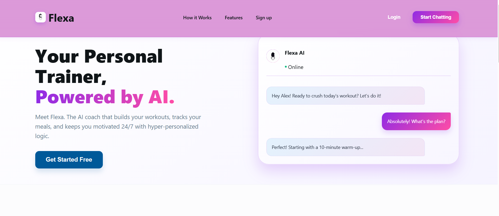
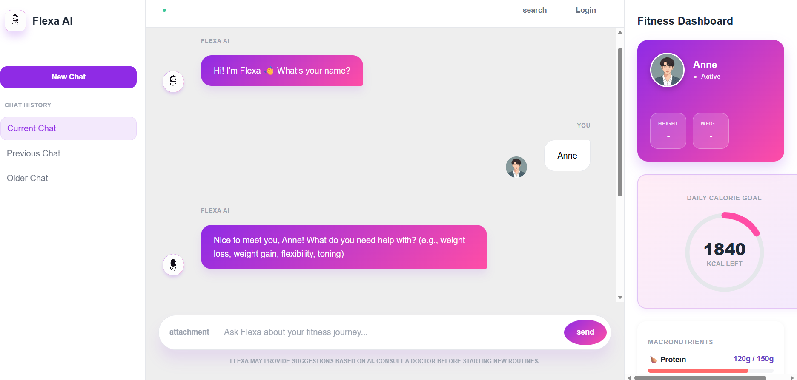

# 🏋️ Flexa - AI-Powered Fitness Chatbot

Flexa is an intelligent fitness chatbot that provides personalized workout plans, diet recommendations, and fitness coaching powered by Machine Learning. The application uses a trained ML model to analyze user health data and deliver customized fitness guidance.





## ✨ Features

### 🤖 ML-Powered Recommendations
- **Personalized Fitness Plans**: ML model trained on fitness data to provide tailored workout routines
- **Adaptive Recommendations**: Plans adjust based on BMI, age, health conditions, and fitness goals
- **Smart Insights**: AI-driven suggestions that adapt to user progress

### 💬 Interactive Chat Interface
- **Conversational Onboarding**: Friendly step-by-step data collection
- **Real-time Responses**: Instant feedback and recommendations
- **State Management**: Maintains conversation context throughout the session

### 📊 Comprehensive Dashboard
- **User Profile**: Height, weight, BMI tracking
- **Calorie Tracker**: Dynamic calorie goal with visual progress ring
- **Macronutrient Breakdown**: Protein, carbs, and fats tracking with progress bars
- **Hydration Monitor**: Daily water intake tracking
- **Activity Stats**: Steps and active minutes tracking
- **Flexa Insights**: Personalized AI-driven recommendations

### 🎯 Health-Focused Features
- **BMI Calculator**: Automatic calculation with health category
- **Health Risk Assessment**: Considers hypertension and diabetes
- **Safety Warnings**: Medical consultation reminders for users with health conditions
- **Goal-Specific Plans**: Separate recommendations for weight loss, gain, toning, and flexibility

### 🎥 Workout Videos
- **YouTube Integration**: Curated workout video recommendations
- **Clickable Links**: Direct access to instructional videos
- **Goal-Aligned Content**: Videos matched to fitness objectives

## 🛠️ Tech Stack

### Frontend
- **React.js** - UI framework
- **React Router** - Navigation
- **CSS3** - Styling with gradients and animations
- **Fetch API** - Backend communication

### Backend
- **FastAPI** - High-performance Python web framework
- **Uvicorn** - ASGI server
- **Pandas** - Data manipulation
- **Scikit-learn** - ML model training and predictions
- **Joblib** - Model serialization
- **Pydantic** - Data validation

### Machine Learning
- **Classification Pipeline** - Custom ML pipeline for fitness plan prediction
- **Feature Engineering** - BMI calculation and categorization
- **Model Persistence** - Joblib-based model storage

## 📁 Project Structure

```
Flexa-ChatBot/
├── flexa-backendnew-main/
│   ├── app/
│   │   ├── main.py              # FastAPI application & endpoints
│   │   ├── ml.py                # ML model loader & recommender
│   │   ├── schema.py            # Pydantic models
│   │   └── utils.py             # Helper functions
│   ├── data/
│   │   └── workouts.json        # YouTube workout video database
│   ├── models/
│   │   └── flexa_plan_model.joblib  # Trained ML model
│   ├── train.py                 # Model training script
│   └── requirements.txt         # Python dependencies
│
├── flexa-frontend-main/
│   ├── public/
│   │   ├── index.html
│   │   ├── Bot1.mp4            # Flexa avatar video
│   │   └── manifest.json
│   ├── src/
│   │   ├── pages/
│   │   │   ├── Chat.js         # Main chat interface
│   │   │   └── Landing.js      # Landing page
│   │   ├── styles/
│   │   │   ├── Chat.css        # Chat styling
│   │   │   └── Landing.css     # Landing page styling
│   │   ├── App.js              # React router setup
│   │   └── index.js            # React entry point
│   └── package.json            # Node dependencies
│
└── README.md                   # This file
```

## 🚀 Getting Started

### Prerequisites
- **Python 3.8+** (for backend)
- **Node.js 14+** and npm (for frontend)
- **Git** (for cloning)

### Backend Setup

1. **Navigate to backend directory:**
```bash
cd flexa-backendnew-main
```

2. **Create virtual environment (optional but recommended):**
```bash
python -m venv venv
source venv/bin/activate  # On Windows: venv\Scripts\activate
```

3. **Install dependencies:**
```bash
pip install -r requirements.txt
```

4. **Start the backend server:**
```bash
uvicorn app.main:app --reload --port 5000
```

The backend will run at `http://localhost:5000`

### Frontend Setup

1. **Navigate to frontend directory:**
```bash
cd flexa-frontend-main
```

2. **Install dependencies:**
```bash
npm install --legacy-peer-deps
```

3. **Start the development server:**
```bash
npm start
```

The frontend will run at `http://localhost:3000`

## 📖 Usage

### 1. Access the Application
Open your browser and navigate to `http://localhost:3000`

### 2. Start Chatting
- The chatbot will greet you and ask for your name
- Answer the questions step by step:
  - Name
  - Fitness goal (weight loss, weight gain, toning, flexibility)
  - Sex (Male/Female)
  - Age
  - Height (in meters)
  - Weight (in kg)
  - Hypertension status (Yes/No)
  - Diabetes status (Yes/No)

### 3. Receive Your Plan
- Flexa will calculate your BMI
- The ML model generates a personalized fitness plan including:
  - Recommended exercises
  - Required equipment
  - Diet recommendations
  - Expert fitness advice

### 4. Get Workout Videos (Optional)
- Choose whether you want YouTube workout video recommendations
- Receive curated videos matching your fitness goals

### 5. Monitor Your Progress
- View your stats in the right sidebar dashboard
- Track calories, macronutrients, hydration, and activity
- Get AI-powered insights based on your profile

## 🎯 API Endpoints

### Chat Endpoints

#### Start Chat Session
```http
GET /chat/start
```
**Response:**
```json
{
  "session_id": "uuid",
  "message": "Hi! I'm Flexa 👋 What's your name?"
}
```

#### Send Message
```http
POST /chat/message
```
**Request:**
```json
{
  "session_id": "uuid",
  "user_message": "John"
}
```
**Response:**
```json
{
  "session_id": "uuid",
  "message": "Nice to meet you, John! What do you need help with?",
  "state": "ASK_PROBLEM",
  "data_collected": { "name": "John" }
}
```

#### Direct Recommendation
```http
POST /recommend
```
**Request:**
```json
{
  "name": "John",
  "sex": "Male",
  "age": 25,
  "height_m": 1.75,
  "weight_kg": 70,
  "hypertension": "No",
  "diabetes": "No",
  "wants_videos": true
}
```

## 🧠 Machine Learning Model

### Training Data
- **Features**: Sex, Age, Height, Weight, Hypertension, Diabetes, BMI, BMI Level
- **Target**: Fitness Plan ID
- **Dataset**: Fitness plans with exercise routines, equipment, diets, and recommendations

### Model Pipeline
1. **Data Preprocessing**: BMI calculation and categorization
2. **Feature Engineering**: Health risk factors, demographic data
3. **Classification**: Predicts optimal fitness plan
4. **Recommendation Engine**: Matches users to workout videos and diet plans

### Model Training
```bash
python train.py
```

## 🎨 Dashboard Features

### Dynamic Components
- **Calorie Ring**: Visual progress toward daily calorie goal
- **Macronutrients**: Protein, carbs, and fats with color-coded bars
- **Flexa Insight**: AI-generated personalized recommendations
- **Hydration Tracker**: Daily water intake with circular progress
- **Activity Stats**: Steps and active minutes with progress indicators

### Smart Insights Examples
- "You're underweight (BMI: 17.2). Focus on high-protein meals and aim for 500 more calories today."
- "Great job! You're 240 kcal under target. A protein-rich snack would optimize recovery."
- "Excellent progress! Your balanced approach is working. Keep it up! 💪"

## 🌟 Key Features Highlights

### 1. Session Management
- Unique session IDs for each conversation
- State-based flow (9 conversation states)
- Data persistence throughout chat

### 2. Health Safety
- Medical consultation warnings for users with health conditions
- BMI-based health categorization
- Risk-aware recommendations

### 3. Responsive Design
- Mobile-friendly layout
- Gradient purple theme
- Smooth animations and transitions
- Video avatar for Flexa

### 4. User Experience
- New Chat button to restart conversation
- Clickable logo to return to landing page
- Real-time message updates
- Loading indicators

## 🔮 Future Enhancements

- [ ] User authentication and profile persistence
- [ ] Progress tracking over time (weekly/monthly charts)
- [ ] Integration with fitness wearables (Fitbit, Apple Watch)
- [ ] Meal planning and calorie tracking from photos
- [ ] Social features (share achievements, challenges)
- [ ] Push notifications for workout reminders
- [ ] Voice-based interaction
- [ ] Multi-language support
- [ ] Custom workout plan builder
- [ ] Integration with nutrition APIs

## 📝 Configuration

### Environment Variables
Create a `.env` file in the backend directory:
```env
# Backend Configuration
PORT=5000
HOST=0.0.0.0

# Frontend URL (for CORS)
FRONTEND_URL=http://localhost:3000

# Model Configuration
MODEL_PATH=models/flexa_plan_model.joblib
WORKOUTS_PATH=data/workouts.json
```

### CORS Configuration
The backend allows requests from `http://localhost:3000` by default. Update in `app/main.py` if needed:
```python
app.add_middleware(
    CORSMiddleware,
    allow_origins=["http://localhost:3000"],  # Update this
    allow_credentials=True,
    allow_methods=["*"],
    allow_headers=["*"],
)
```

## 🐛 Troubleshooting

### Backend Issues

**Problem**: ModuleNotFoundError
```bash
Solution: pip install -r requirements.txt
```

**Problem**: Port already in use
```bash
Solution: uvicorn app.main:app --reload --port 5001
```

### Frontend Issues

**Problem**: npm install fails
```bash
Solution: npm install --legacy-peer-deps
```

**Problem**: React app won't start
```bash
Solution: Delete node_modules and package-lock.json, then npm install
```

**Problem**: Can't connect to backend
```bash
Solution: Ensure backend is running on port 5000
Check CORS settings in backend
```

## 📄 License

This project is created for educational purposes as part of a university project.


## 🙏 Acknowledgments

- FastAPI for the excellent web framework
- React team for the powerful UI library
- Scikit-learn for ML capabilities
- YouTube for workout video content

---

**Built with ❤️ by the Flexa Team**

*Empowering fitness journeys through AI and personalization*
